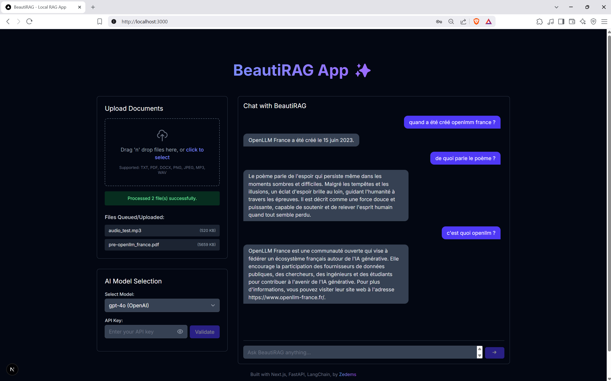

# BeautiRAG App ✨

<!--  -->
<p style="text-align: center;">
  
</p>


BeautiRAG is a multi-modal Retrieval-Augmented Generation (RAG) application built with Next.js for the frontend, LangChain framework and FastAPI for the backend. It allows to upload various document types (text, PDF, images, audio), processes them, stores embeddings locally using FAISS, and provides a chat interface to query the documents using large language models (LLMs).

## Features

*   **Frontend:** Built with ``Next.js`` and ``Tailwind CSS``
    *   Drag-and-drop document upload (TXT, PDF, DOCX, PNG, JPG, MP3, WAV)
    *   Chat interface
    *   Selection and API key input of different LLMs OpenAI, Anthropic, DeepSeek, Ollama (to be integrated)
*   **Backend:** Built with ``FastAPI`` and ``LangChain`` framework
    *   Document processing using LangChain loaders.
    *   OCR for images using ``Tesseract``.
    *   Transcription for audio using ``OpenAI Whisper``.
    *   Embedding generation using Sentence Transformers ``all-MiniLM-L6-v2`` (planning to extend to other models).
    *   Vector storage using FAISS (local).
    *   RAG pipeline implementation using LangChain Expression Language (LCEL).
    *   API endpoints for file upload, processing, and querying.
*   **Containerization:** Dockerized using ``Docker Compose`` for easy setup and deployment.

## Project Structure

```
rag-app/
├── beautirag-app/
│   ├── public/
│   ├── src/
│   │   ├── app/         # Next.js frontend pages/routing
│   │   ├── components/  # React components
│   │   └── backend/     # FastAPI backend application
│   │       ├── core/      # Core components (config)
│   │       ├── services/  # RAG, processor, vector store
│   │       ├── data/      # Local data storage
│   │       ├── .dockerignore
│   │       ├── Dockerfile # Backend Dockerfile
│   │       └── requirements.txt
│   ├── .dockerignore
│   ├── .env           # Will be used for default API key set up
│   ├── Dockerfile     # Frontend Dockerfile
│   ├── next.config.ts
│   ├── package.json
│   └── ...            # Other frontend config files
├── .gitignore
├── docker-compose.yml
└── README.md       
```

## Prerequisites

*   [Docker](https://www.docker.com/products/docker-desktop/) and Docker Compose (if using Linux)
*   An `.env` file in the `beautirag-app` directory (will be necessary in the future).
*   System dependencies for backend features:
    *   **Tesseract:** For image OCR. Installation varies by OS ([Tesseract Wiki](https://tesseract-ocr.github.io/tessdoc/Installation.html)).
    *   **FFmpeg:** For audio processing by Whisper. Installation varies by OS ([FFmpeg Download](https://ffmpeg.org/download.html)).
    *   *Note: These are installed automatically within the Docker container.* For local development/testing outside Docker, need to install them on the host machine.

## Setup & Launch

### 1. Clone the Repository (if applicable)

```bash
git clone <repository-url>
cd rag-app
```

### 2. Create Environment File

Create a file named `.env` inside the `beautirag-app` directory:

```bash
cd beautirag-app
touch .env
```

Add your API keys and any necessary configurations to this `.env` file. Example:

```dotenv
OPENAI_API_KEY=sk-...
ANTHROPIC_API_KEY=sk-ant-...
DEEPSEEK_API_KEY=sk-...

# WHISPER_MODEL_SIZE=small

# EMBEDDING_MODEL_NAME=...

# If Tesseract is not in system PATH for local dev (not needed for Docker)
# TESSERACT_CMD="C:/Program Files/Tesseract-OCR/tesseract.exe"
```

### 3. Launch using Docker Compose

This is the easiest way to run the application with all dependencies included.   
From the project root directory (`rag-app`):

```bash
docker compose up --build
```

*   The `--build` flag is needed the first time or after code changes.
*   Wait for both `backend` and `frontend` services to start and the backend healthcheck to pass.
*   Navigate to `http://localhost:3000` in the browser

To stop the application:

```bash
docker compose down
```

### 4. Local Development/Test (Alternative)

It is possible to run the frontend and backend separately without Docker:

**Backend Setup:**

1.  Navigate to the backend directory:
    ```bash
    cd beautirag-app/src/backend
    ```
2.  Create a Python virtual environment:
    ```bash
    python -m venv .venv
    .\.venv\Scripts\activate # Windows
    ```
3.  Install dependencies:
    ```bash
    pip install -r requirements.txt
    ```
4.  Ensure Tesseract and FFmpeg are installed on your system and accessible
5.  Ensure the `.env` file exists in the `beautirag-app` directory
6.  Run the FastAPI server (from the `beautirag-app/src` directory):
    ```bash
    cd .. # Go up to src directory
    uvicorn backend.main:app --reload --port 8000
    ```

**Frontend Setup:**

1.  Navigate to the frontend directory:
    ```bash
    cd beautirag-app
    ```
2.  Install dependencies:
    ```bash
    npm install
    ```
3.  Run the Next.js development server:
    ```bash
    npm run dev
    ```
4.  Navigate to `http://localhost:3000` in the browser

## Usage

1.  **Upload Documents:** Use the "Upload Documents" section to drag and drop or select files.
2.  **Configure Model:** Select the desired LLM and enter the API key if required. Click "Validate".
3.  **Chat:** Use the chat interface to ask questions about the content of the uploaded documents.
